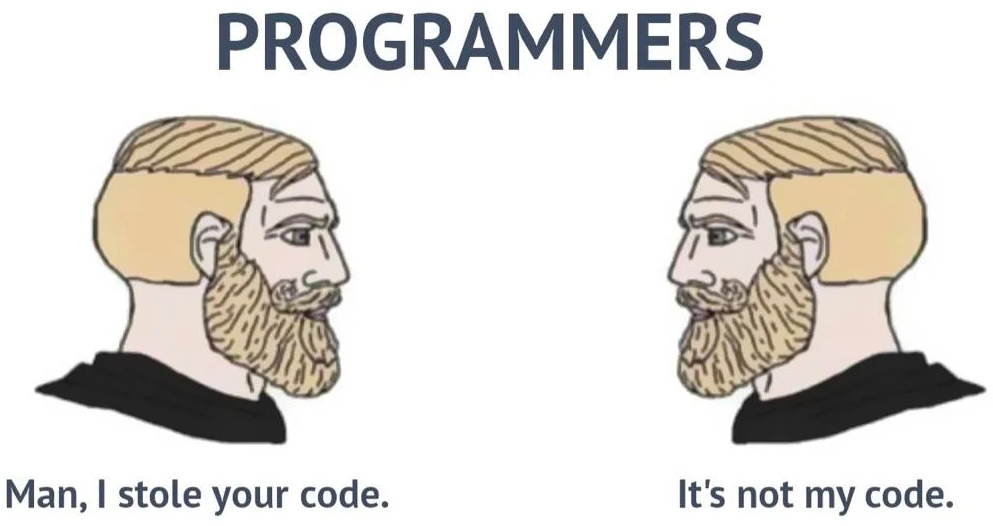

# Ejercicios de Programación Avanzada - 2do C 2022

Ejercicios de Java y algunos de Prolog, ejercicios de la OIA, modelos de parcial, realizados para la cursada de Programación Avanzada (1113, creo) durante el 2do cuatrimestre de 2022. Todo gratis.
 
 

